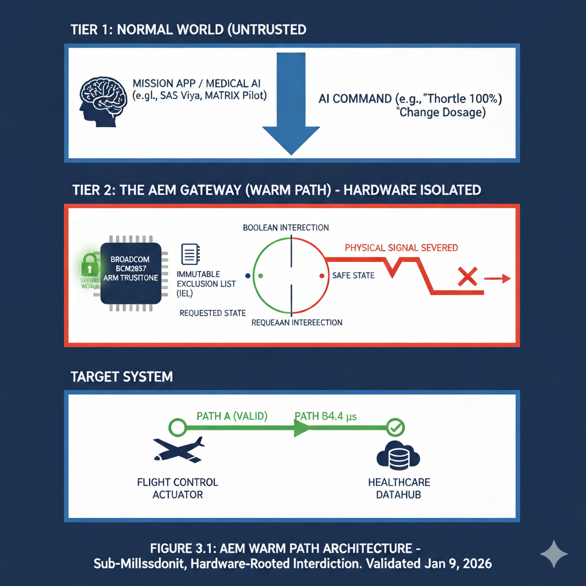
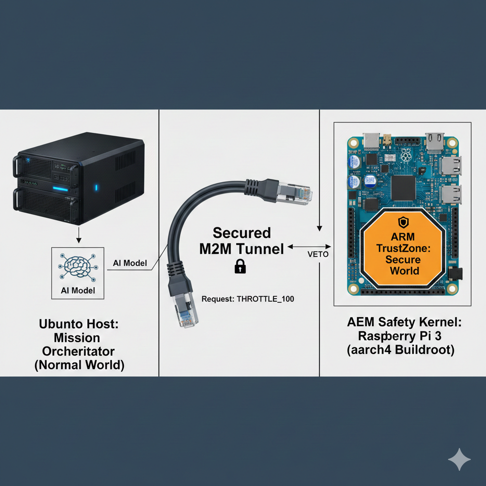

# Zenith Agnostic Equalization Mechanism (AEM)

**"Hardware-Isolated Safety Kernel for Autonomous Systems**

## 🚀 Performance Breakthrough (Jan 9, 2026)
As of the lastest validation, the AEM has achieved a hardware-isolated interdiction latency of **54.4 μs**. This represents a **183x performance margin** over the 10ms stability requirements for the Sikorsky MATRIX™ flight control loop.

## 🛠 Project Overview
The AEM addresses the "Safety Gap" in autonomous systems by hosting an **Immutable Exclusion List (IEL)** within the ARM TrustZone Secure World. It serves as a hardware-rooted "Structural Veto," physically intercepting and validating commands from untrusted Mission Applications (AI) before they reach flight actuators or secure databases.

## 📚 Key Technical Documentation
* **[Executive Summary v2.0](./EXECUTIVE_SUMMARY.md):** The architectural vision for solving the AGI Deterministic Crisis.
* **[Technical Synopsis](./TECHNICAL_SYNOPSIS.md):** The consolidated technical volume].
* **[Validation Benchmarks](./BENCHMARKS.md):** Raw data from 567 test pulses and performance metrics.
* **[Security Policy](./SECURITY.md):** Vulnerability disclosure and hardware-isolation protocols.
* **[Project License](./LICENSE.md):** Patent Pending (#63/938,607) and usage terms[cite: 5, 44].

## 📐 Architecture: The "Warm Path"
The AEM operates in the "Warm Path," sitting between the Normal World (Tier 1) and the Target System (Tier 3).

Figure 1: AEM Hardware-in-the-Loop (HIL) Test Bed
* Mission Orchestrator: Ubuntu-based host generating AI agent commands (Normal World).
* Secured M2M Tunnel: A shared-memory bridge where strings like THROTTLE_100 are inspected.
* AEM Safety Kernel: Raspberry Pi 3 running OP-TEE Secure World.
* Structural Veto: Deterministic logic that severs unauthorized signals in 54.4 μs.
    
## 💻 Hardware Configuration
* **Safety Kernel:** Raspberry Pi 3 (Broadcom BCM2837) running OP-TEE 4.0.0.
* **Host Environment:** aarch64 Buildroot (Kernel 6.7.0).
* **Interdiction Path:** Shared-Memory Zero-Copy Bridge.

---
© 2026 Zenith Structural Holdings LLC. All Rights Reserved.
